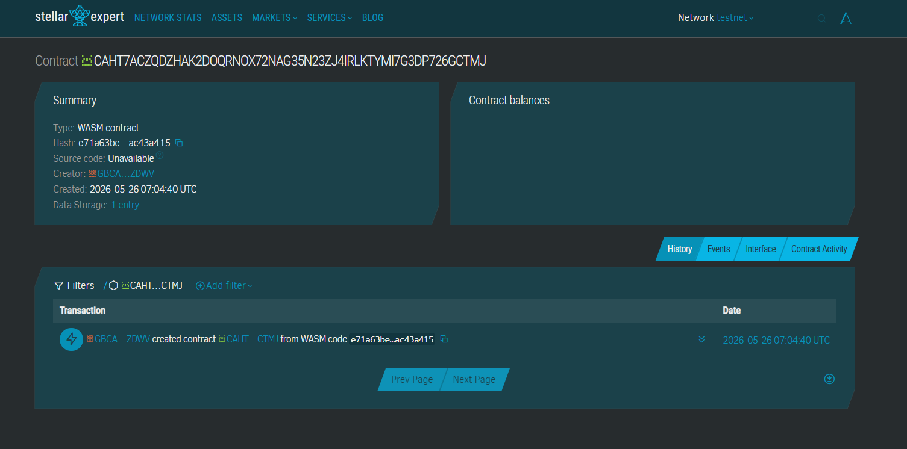

# 🇵🇭 GigPay: Decentralized Freelance Escrow on Stellar

**GigPay** is a borderless payment solution designed for Southeast Asian freelancers to receive international payments instantly, securely, and with near-zero fees using **USDC on Stellar** and **Soroban Smart Contracts**.

---

## Contract ID: CAHT7ACZQDZHAK2DOQRNOX72NAG35N23ZJ4IRLKTYMI7G3DP726GCTMJ
## Contract Link:https://stellar.expert/explorer/testnet/contract/CAHT7ACZQDZHAK2DOQRNOX72NAG35N23ZJ4IRLKTYMI7G3DP726GCTMJ



## 📖 The Problem
In Manila, a Filipino freelance graphic designer named **Jia** invoices a US client via email. She:
* Waits **5–7 days** for PayPal clearance.
* Loses **5% or more** in conversion and platform fees.
* Lives in fear of **chargeback fraud** after submitting her work.

## 💡 The Solution
Jia creates a **GigPay payment link** in USDC. 
1.  The client pays instantly with near-zero network fees.
2.  A **Soroban escrow contract** holds the funds.
3.  Funds are released automatically when deliverables are submitted.
4.  **Result:** No chargeback risk, no fiat friction, and instant liquidity.

---

## 🎯 Target Users
* **Who:** Filipino freelance designers, writers, and developers earning ~$800/month.
* **Where:** Metro Manila, Cebu, Davao, and beyond.
* **Why They Care:** Get paid in USDC within minutes, avoid 5%+ PayPal/Payoneer fees, and eliminate chargeback scams.

---

## 🔧 Stellar & Soroban Features Used
* **USDC Transfers:** Cross-border stablecoin payments for price stability.
* **Soroban Smart Contracts:** Trustless escrow logic (fund hold, release).
* **Custom Tokens:** GigPay tokens for loyalty and platform discounts.
* **Trustlines:** Secure token setup for USDC and assets.

---

## 🏗️ Project Architecture
1.  **Freelancer** creates an invoice (Smart Contract Deployment).
2.  **Client** deposits USDC into the contract.
3.  **Contract** holds funds in a trustless state.
4.  **Freelancer** uploads proof of work (Hash/Link).
5.  **Funds** are released to the Freelancer's Stellar wallet instantly.

---

## ⏱️ Timeline & Roadmap
| Phase | Duration | Focus | Key Deliverables |
| :--- | :--- | :--- | :--- |
| **MVP** | Week 1 | Escrow Contract | Core logic & invoice creation scripts. |
| **Beta** | Week 2 | Frontend Web App | React dashboard & payment flow. |
| **Testnet** | Week 3 | USDC Integration | Live demo on Stellar Testnet. |
| **Polish** | Week 4 | UI/UX & Launch | Bug fixes, documentation, and pitch prep. |

---

## 🛠️ Prerequisites
Ensure you have the following installed to interact with the contracts:

```bash
# 1. Install Rust
curl --proto '=https' --tlsv1.2 -sSf [https://sh.rustup.rs](https://sh.rustup.rs) | sh

# 2. Install Soroban CLI
cargo install soroban-cli --locked

# 3. Verify Installations
rustc --version    # Required: 1.75.0+
soroban --version  # Required: 20.0.0+
